# ReactAct

ReactAct is a job application tracker and resume tailoring workspace built for job search management, recruiter outreach, bulk mail, bulk outreach, follow-up mail management, and interview workflow organization.

It helps job seekers manage resumes, track applications, organize companies and recruiter contacts, schedule follow-ups, preview test mails, handle bulk outreach, send bulk mail, and tailor resumes for target roles from one place.

## What Problem It Solves

Most job seekers lose time and momentum because their process is scattered:

- resumes are saved in random files
- job descriptions are copied manually
- recruiter and company details are not tracked properly
- follow-ups get missed
- tailored resumes are created inconsistently
- application progress becomes hard to review

ReactAct solves that by centralizing the full workflow:

- build and manage resume data
- tailor resumes to job descriptions
- track jobs, companies, employees, and applications
- keep templates and reusable content organized
- speed up data capture with a browser extension

## Main Features

### Authentication

- user signup
- user login with JWT
- protected app routes

### Resume Management

- create and edit resume/profile data
- parse resume input
- tailor resume content for a job description
- optimize resume quality
- export ATS-friendly PDF
- preview saved resumes

### Job Search Tracking

- manage application tracking records
- test follow-up mail flows
- view tracking schedule data

### Reusable Content

- templates
- subject templates
- achievements
- interview items
- profile panels

### Bulk Operations

- bulk upload jobs
- bulk upload employees

### Chrome Extension

- save jobs from supported pages
- save employee details from supported pages
- connect directly to the backend API
- log in separately with backend username/password

## Setup

Use the root setup script to install dependencies and start the app:

```bash
chmod +x setup.sh
./setup.sh
```

What it does:

- creates a backend virtual environment
- installs backend requirements
- installs frontend dependencies
- runs migrations
- starts backend and frontend servers

If `backend/venv` already exists, the script asks for another name or falls back to a new one automatically.

## Main App Pages

Public pages:

- Login
- Register

Protected pages:

- Home
- Profile
- Templates
- Companies
- Tracking
- Tracking Schedule
- Tracking Detail
- Tracking Test Mail
- Jobs
- Bulk Upload
- Builder
- Preview

## Page-Wise Features

### Login

- sign in with username and password
- redirects back to the last protected page after successful login

### Register

- create a new account
- basic validation for password confirmation and required fields

### Home

- dashboard-style home page
- quick visibility into profile, companies, jobs, tracking rows, and interviews

### Profile

- edit personal profile information
- manage contact details, links, location, and summary
- manage SMTP, IMAP, and AI-related settings
- manage templates, subject templates, interview records, and resume-related supporting data

### Templates

- view saved template library
- filter templates by category
- browse paginated template records

### Companies

- manage company records
- create and edit employee/contact records linked to companies
- search, filter, and sort company and employee data

### Tracking

- create and manage application tracking rows
- connect tracking to companies, jobs, employees, resumes, and templates
- handle fresh mail and follow-up flow configuration
- view list state, filters, ordering, preview, and action controls

### Tracking Schedule

- view current and upcoming scheduled tracking rows
- review what is expected to be sent next

### Tracking Detail

- detailed tracking summary for one row
- employee-wise delivery view
- sent and received mail history
- timeline/action history for the tracking item

### Tracking Test Mail

- generate preview mail content before sending
- review employee-specific mail output
- approve and save final mail test data

### Jobs

- manage job records
- connect jobs to companies
- filter, sort, edit, delete, and preview job-related data

### Bulk Upload

- bulk upload employee data
- bulk upload job data
- submit either JSON input or file-based data
- review success and error summaries after upload

### Builder

- main resume workspace
- build and edit resume content
- import/parse resume input
- attach job description text
- tailor resume using AI modes
- optimize resume quality
- save resume versions
- export ATS PDF

### Preview

- preview a saved resume
- open PDF/export action for the selected resume

## Profile And Mail Setup Guide

Before using manual send or schedule, complete the Profile page carefully. This is the most critical setup for mail flow and personalized content.

### Critical Profile Setup

- Full Name: used in signature and profile-based content
- Email: main identity for mail flow
- Current Employer: used in template personalization
- Years of Experience: used in template and subject personalization
- Resume Link: used when template or subject needs resume reference
- SMTP Host, Port, User, Password, From Email, TLS: required for actual mail sending
- IMAP Host, Port, User, Password, Folder: required for reply or bounce checking flow
- OpenAI API Key and Model: required for tailored resume generation and AI-based personalized mail content

Important:

- add SMTP and IMAP details if you want mail trigger, scheduling, and inbox verification to work properly
- add your OpenAI key if you want tailored resume generation and stronger personalized mail paragraphs based on employee/about data

### Supported Keywords

Use these keywords in templates and subject templates:

| Keyword | What it fills |
|---|---|
| `{name}` | employee name |
| `{employee_name}` | employee name |
| `{first_name}` | employee first name |
| `{employee_role}` | employee role |
| `{department}` | employee department |
| `{employee_department}` | employee department |
| `{company_name}` | target company name |
| `{current_employer}` | your current employer from profile |
| `{role}` | target job role |
| `{job_id}` | job ID |
| `{job_link}` | saved job link |
| `{resume_link}` | your resume link from profile |
| `{years_of_experience}` | your years of experience |
| `{yoe}` | short form of years of experience |
| `{interaction_time}` | tracking interaction date/time, mainly useful in follow-up style content |
| `{interview_round}` | reserved for interview round wording; keep optional because it may be blank |

### Template Writing Examples

Example template paragraph 1:

```text
I am reaching out regarding the {role} opportunity at {company_name}. With {years_of_experience} years of experience and recent work at {current_employer}, I believe my background aligns well with the role.
```

Example template paragraph 2:

```text
I noticed your work as {employee_role} in the {department} team at {company_name}. I would love to be considered for the {role} position and have attached my profile for review.
```

Example subject template:

```text
Application for {role} at {company_name} | {job_id}
```

### Fresh And Follow Up Rules

- Fresh mail requires at least 3 templates and must include at least one Opening template and one Closing template.
- Follow Up requires 1 to 2 templates only, and every selected template must be from the Follow Up category.

Use `interaction_time` only when the mail refers to a previous call, interview, or follow-up moment.
Use `interview_round` only when you intentionally want round wording, and write the sentence so it still reads fine if that value is empty.

### Writing Rules

- never include `Hi []`
- never hardcode personal sign-off lines like `Thanks,`, `Your Name`, `Regards`, or similar closing identity lines
- never manually repeat personal identity details that already come from profile
- greeting and signature should be left to the app flow and profile data, not duplicated in template text

Wrong example:

```text
Hi [],

I am interested in the {role} role at {company_name}.

Thanks,
Subrat Singh
subrat@email.com
```

Why this is wrong:

- `Hi []` is an empty greeting pattern and looks broken
- the last lines repeat sender details manually
- the app can fill greeting and ending from your profile flow

Correct example:

```text
I am interested in the {role} role at {company_name}. With {years_of_experience} years of experience at {current_employer}, I believe my background is a strong match.
```

Let the app add the greeting and closing automatically from your profile details.

### Always Test Before Sending

- always open the Tracking Test Mail panel before Manual Send or Schedule
- Test Mail is preview-only, so you can verify the final content before any real send happens

## Chrome Extension

The extension helps capture job and employee details faster from hiring pages and LinkedIn.

1. Open `chrome://extensions/`
2. turn on `Developer mode`
3. click `Load unpacked`
4. select the `chrome-extension` folder from this repo
5. open the side panel
6. enter API base, username, and password
7. click `Login`

Main features:

- Job Create: fetch current page details and save job data
- Employee Create: fetch recruiter or employee details and save them

Notes:

- login is separate from web app or admin login
- use your app API base, not the admin URL

## Screenshots

Add product screenshots in `assets/screenshots/` and reference them here.
Recommended screenshots:

- Job Page
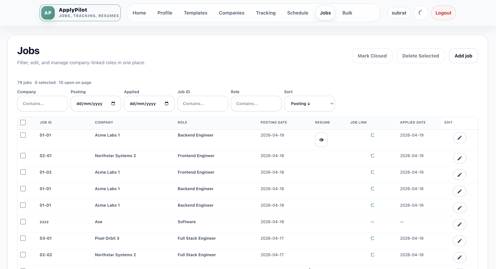
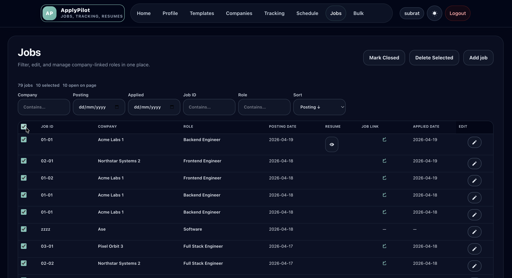

- Home page
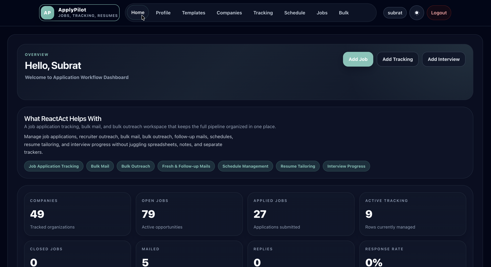
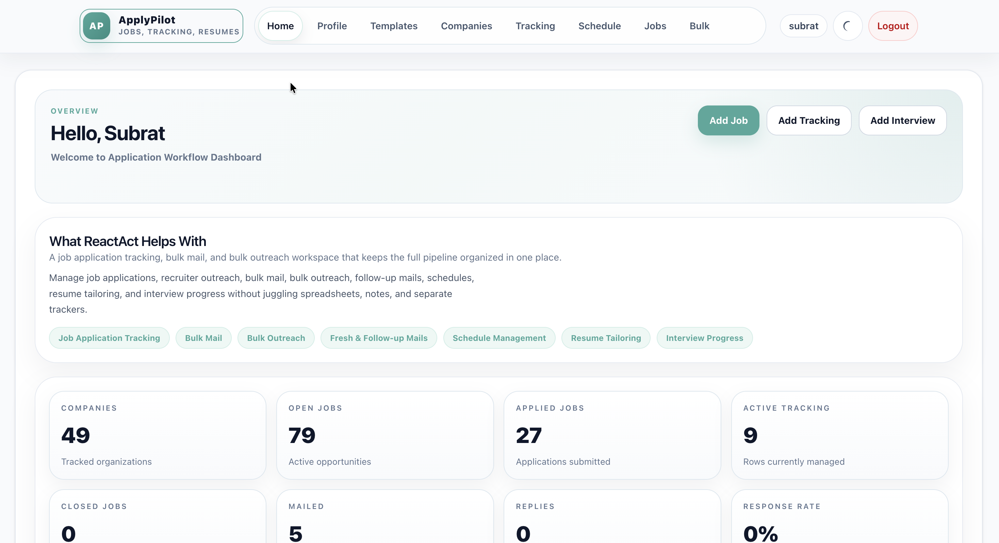

- Profile page
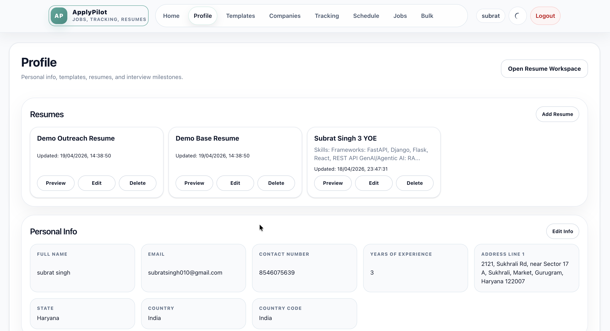

- Company And Employee Page
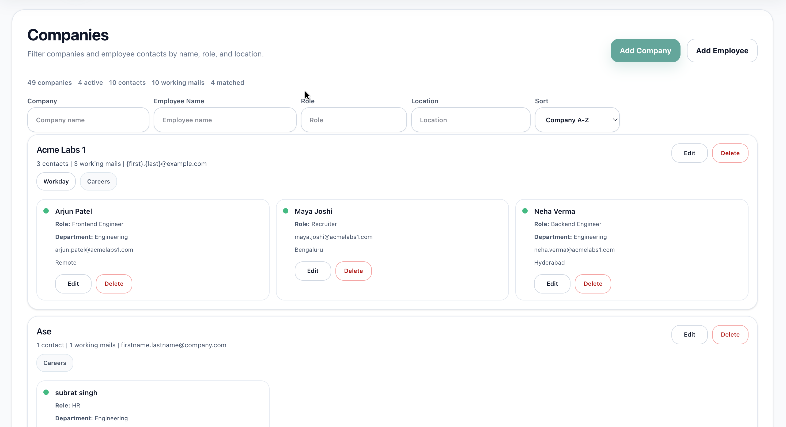


- Tracking Test Mail panel
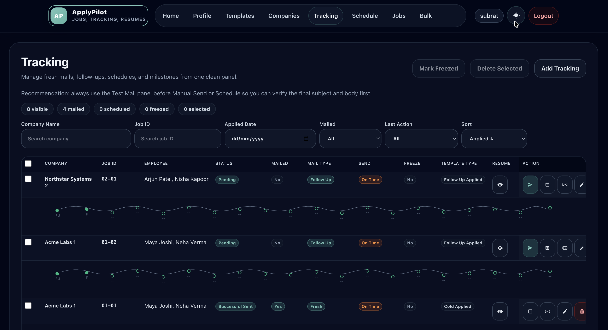
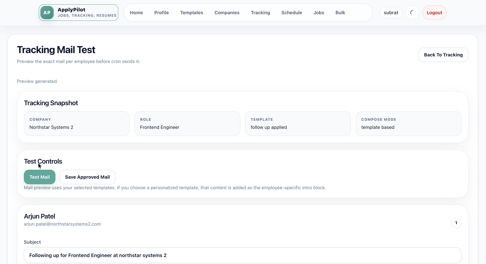
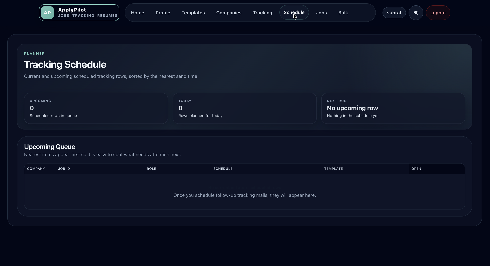
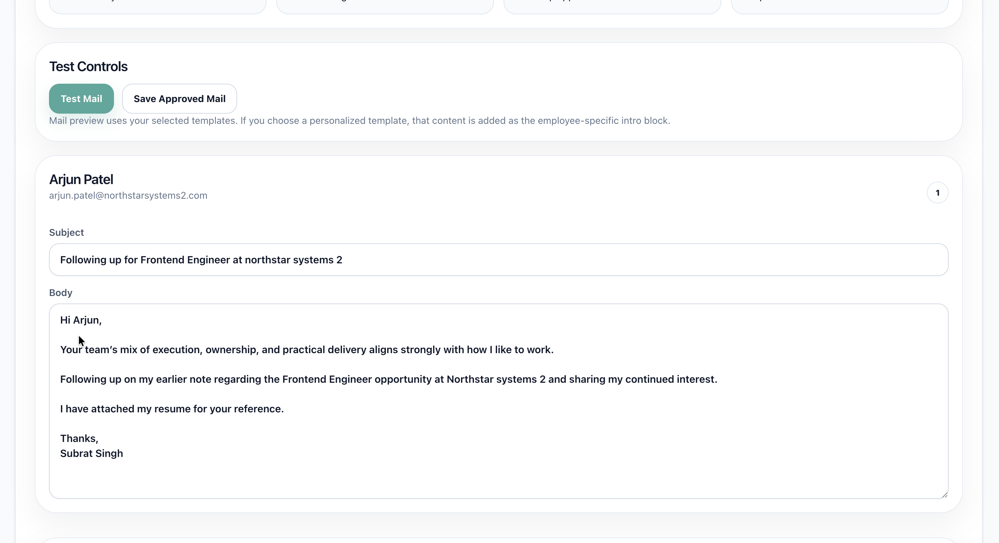


- Mail Details page
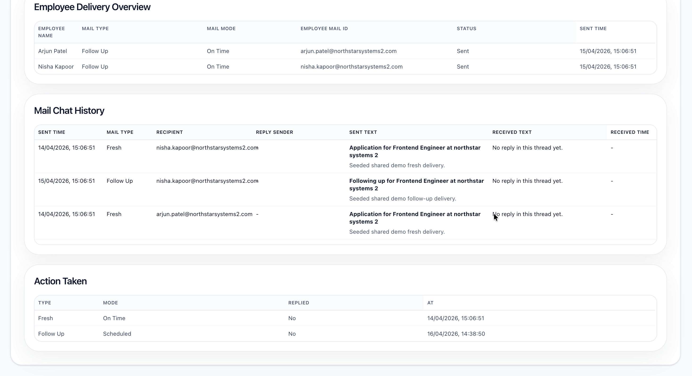

- Chrome Extension side panel
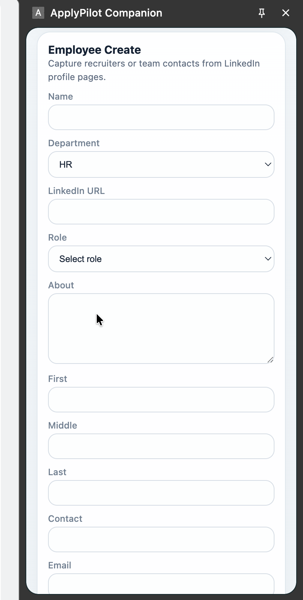
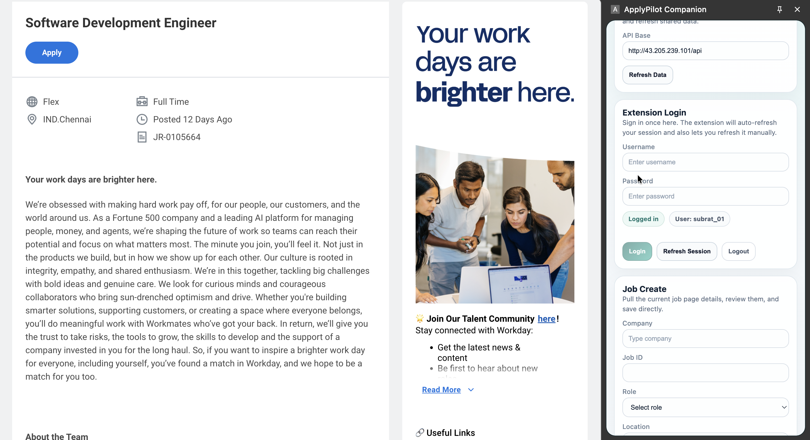